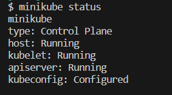

# Kubernetes Demo
---

*This shows a simple kubernetes deployment on a local PC using minikube. A simple webapp and another express app are deployed.*

**Step 1 - Install Minikube on PC**
---

- If chocolatey is installed on your PC, run `choco install minikube`. Ensure Docker is installed on your device as minikube needs it to run.

- After minikube is installed, run `minikube start --driver docker`. It'll download some dependencies in the background.

*You may see a minikube warning message about it not being able to locate the docker endpoint. Run `docker context ls` to see the available endpoints, then change to the one with Docker Desktop in the description by running `docker context use xxx`*

- Run `minikube status` to see if minikube is properly installed.



**Step 2 - Set Up Kubernetes Config File**
---

*Templates on creating K8s config files can be found in the official kubernetes documentation*

- Create config map file for K8s called `mongo-config`.

```
apiVersion: v1
kind: ConfigMap
metadata:
  name: mongo-config
data:
  mongo-url: mongo-service
```

- Create another file called `mongo-secret`, which will hold the username and password for mongodb.

```
apiVersion: v1
kind: Secret
metadata:
  name: mongo-secret
type: Opaque
data:
  mongo-user: bW9uZ291c2Vy
  mongo-password: bW9uZ29wYXNzd29yZA==
```

*Since the values of mongo secret are base64 encoded, you can't use plain text. Run `echo -n mongouser | base64` to convert the username to base64.*

- Create a new file called `mongo.yaml`, which will be used to create deployment and service for mongodb.

```
apiVersion: apps/v1
kind: Deployment
metadata:
  name: mongo-deployment
  labels:
    app: mongo
spec:
  replicas: 1
  selector:
    matchLabels:
      app: mongo
  template:
    metadata:
      labels:
        app: mongo
    spec:
      containers:
      - name: mongodb
        image: mongo:7.0.2
        ports:
        - containerPort: 27017
```

- Create a service in `mongo.yaml`. This is done by segmenting the code in `mongo.yaml` and adding the code below:

```
apiVersion: v1
kind: Service
metadata:
  name: mongo-service
spec:
  selector:
    app: mongo
  ports:
    - protocol: TCP
      port: 27017
      targetPort: 27017
```

*Segmentation is done using a `---` at the end of the old code and beginning of the new code.*

**Step 3 - Create Webapp Configuration**
---

- Insert the code below into a new file called `webapp.yaml` to create the deployment file for the demo app. *You can copy the current config in mongo.yaml and rework*.

```
apiVersion: apps/v1
kind: Deployment
metadata:
  name: webapp-deployment
  labels:
    app: web
spec:
  replicas: 1
  selector:
    matchLabels:
      app: web
  template:
    metadata:
      labels:
        app: web
    spec:
      containers:
      - name: webapp
        image: nanajanashia/k8s-demo-app:v1.0
        ports:
        - containerPort: 3000
---
apiVersion: v1
kind: Service
metadata:
  name: webapp-service
spec:
  selector:
    app: web
  ports:
    - protocol: TCP
      port: 3000
      targetPort: 3000
```

